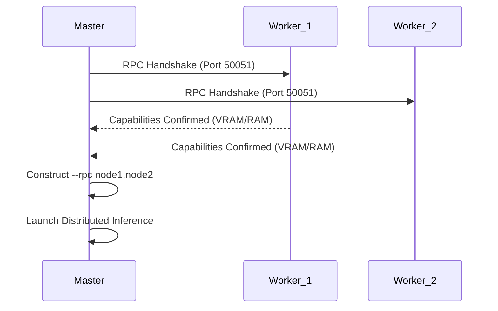

# ⬡ NEUREX COMPENDIUM: THE TECHNICAL SPECIFICATION

> **Version**: 1.0.0-BETA  
> **Classification**: TOP SECRET / FEDERATED INTELLIGENCE  
> **Status**: EXHAUSTIVE

---

## ⚓ NAVIGATION
1.  [**FEDERATED COMPUTE MESH**](#1-federated-compute-mesh)
2.  [**HIVE MIND (COLLECTIVE MEMORY)**](#2-hive-mind-collective-memory)
3.  [**AGENTIC ORCHESTRATION & MCP**](#3-agentic-orchestration--mcp)
4.  [**SECURITY, GOVERNANCE & RBAC**](#4-security-governance--rbac)
5.  [**DEVELOPER INTERFACE & COLLABORATION**](#5-developer-interface--collaboration)
6.  [**MOBILE CONTROL CENTER**](#6-mobile-control-center)

---

## 1. FEDERATED COMPUTE MESH

Neurex transforms isolated hardware into a unified, high-performance compute cell.

### 1.1 MeshRouter (The Traffic Controller)
The `MeshRouter` is the intelligent layer that determines where a specific inference task should execute. It uses a **Weighted-Load Balancing** algorithm.

**Score Formula**:
```text
NodeScore = (VRAM * 2) / ((CPU_Load + Latency/10 + Queue_Depth * 20) + 1)
```

### 1.2 Distributed Tensor Pooling (DistributedManager)
Neurex utilizes `llama.cpp`'s RPC backend to slice massive models (e.g., Llama-3-70B) across multiple machines.

**Handshake Flow**:


### 1.3 Swarm Heartbeat
Nodes broadcast their health every 15 seconds via the `PresenceManager`.
*   **VRAM Utilization**: Dynamic tracking for 8k context windows.
*   **CPU Pressure**: Prevents routing to machines under heavy local load.
*   **Network Latency**: Prioritizes nodes on the same local subnet.

---

## 2. HIVE MIND (COLLECTIVE MEMORY)

The Hive Mind is a decentralized vector memory layer based on **ChromaDB**.

### 2.1 The Semantic Loop
When an agent or human performs a task, the result is indexed.
*   **Embeddings**: `sentence-transformers` generating high-dimensional vectors.
*   **Chunking**: Tree-Sitter based code-aware chunking to preserve logical blocks.

### 2.2 MemoryWorker (The Archivist)
A background process that watches the filesystem using `watchdog`. Every file save triggers a semantic update.

**Performance Graph (Indexing Latency)**:
```text
Latency (ms)
|
|      * (70B Model Inference)
|     /
|    * (Vector Search)
|   /
|--*----*----*---- (File Save / Indexing)
+------------------ Time
```

---

## 3. AGENTIC ORCHESTRATION & MCP

Neurex agents are not simple LLM calls; they are specialized personas operating in a state-persistent environment.

### 3.1 Specialized Personas
*   **Planner**: Goal decomposition and dependency mapping.
*   **Coder**: High-fidelity implementation with linting awareness.
*   **Reviewer**: Security and logic validation.
*   **Tester**: Automated unit/integration test generation.

### 3.2 MCP (Model Context Protocol) Integration
Neurex acts as a primary MCP client, providing agents with:
*   **Browser Tool**: Headless navigation for documentation research.
*   **Filesystem Tool**: Safe, scoped I/O operations.
*   **Terminal Tool**: PTY-based shell execution with HITL approval.

---

## 4. SECURITY, GOVERNANCE & RBAC

Neurex is built for enterprise-grade "Zero Trust" isolation.

### 4.1 RBAC Engine (Role-Based Access Control)
*   **ADMIN**: Full control over Mesh, Hive Mind, and Infrastructure.
*   **DEVELOPER**: Read/Write access to code and agents; restricted infra toggles.
*   **VIEWER**: Read-only access to logs and project state; inputs disabled.

### 4.2 One-Way Trash (File Protection)
Agents cannot permanently delete files. The `neurex_trash_path` is a write-only directory for agents, preventing "ghosting" of malicious edits.

### 4.3 Sandbox Isolation
All terminal operations execute in a scoped PTY or optional Docker container, preventing unauthorized host access.

---

## 5. DEVELOPER INTERFACE & COLLABORATION

### 5.1 Ghost Collaboration
Real-time multiplayer powered by WebSockets.
*   **Presence Bar**: Shows active collaborators (Human or Agent).
*   **Cursor Broadcasting**: Low-latency coordinate sync.
*   **State Locking**: Prevents race conditions during multi-agent coding sessions.

### 5.2 The Skills System
Python-based "Skills" that allow users to extend Neurex with custom tools.
*   **SkillManager**: Dynamically loads and hot-swaps agent capabilities.

---

## 6. MOBILE CONTROL CENTER

The Neurex Mobile App provides an off-band security channel.

*   **HITL Approvals**: Push notifications for critical shell commands.
*   **Mesh Telemetry**: Real-time VRAM/CPU monitoring from your pocket.
*   **Biometric Lock**: Fingerprint/FaceID required for remote mesh management.

---

**⬡ NEUREX: Absolute Autonomy. Federated Intelligence.**
