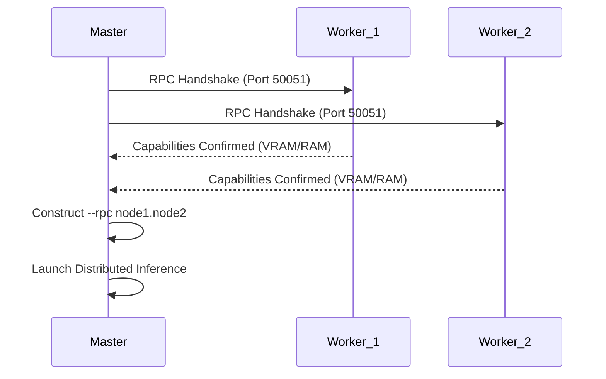

# ⬡ NEUREX COMPENDIUM: THE TECHNICAL SPECIFICATION

> **Version**: 1.0.0-BETA  
> **Classification**: TOP SECRET / FEDERATED INTELLIGENCE  
> **Status**: EXHAUSTIVE / DEEP DIVE

---

## ⚓ NAVIGATION
1.  [**FEDERATED COMPUTE MESH**](#1-federated-compute-mesh)
2.  [**HIVE MIND (COLLECTIVE MEMORY)**](#2-hive-mind-collective-memory)
3.  [**AGENTIC ORCHESTRATION & MCP**](#3-agentic-orchestration--mcp)
4.  [**SECURITY, GOVERNANCE & RBAC**](#4-security-governance--rbac)
5.  [**DEVELOPER INTERFACE & COLLABORATION**](#5-developer-interface--collaboration)
6.  [**MOBILE CONTROL CENTER**](#6-mobile-control-center)
7.  [**APPENDIX: PERFORMANCE GRAPHS**](#7-appendix-performance-graphs)

---

## 1. FEDERATED COMPUTE MESH

Neurex transforms isolated hardware into a unified, high-performance compute cell.

### 1.1 MeshRouter (The Traffic Controller)
The `MeshRouter` is the intelligent layer that determines where a specific inference task should execute. It uses a **Weighted-Load Balancing** algorithm.

**Score Formula**:
```text
NodeScore = (VRAM * 2) / ((CPU_Load + Latency/10 + Queue_Depth * 20) + 1)
```

### 1.2 Distributed Tensor Pooling (DistributedManager)
Neurex utilizes `llama.cpp`'s RPC backend to slice massive models (e.g., Llama-3-70B) across multiple machines.

**Handshake Flow**:


### 1.3 Swarm Heartbeat
Nodes broadcast their health every 15 seconds via the `PresenceManager`.
*   **VRAM Utilization**: Dynamic tracking for 8k context windows.
*   **CPU Pressure**: Prevents routing to machines under heavy local load.
*   **Network Latency**: Prioritizes nodes on the same local subnet.

---

## 2. HIVE MIND (COLLECTIVE MEMORY)

The Hive Mind is a decentralized vector memory layer based on **ChromaDB**.

### 2.1 The Semantic Loop
When an agent or human performs a task, the result is indexed.
*   **Embeddings**: `sentence-transformers` generating high-dimensional vectors.
*   **Chunking**: Tree-Sitter based code-aware chunking to preserve logical blocks.

### 2.2 MemoryWorker (The Archivist)
A background process that watches the filesystem using `watchdog`. Every file save triggers a semantic update.

### 2.3 Search Mechanics
Neurex performs **Semantic Recall** during the planning phase.
*   **Query**: "How did we handle JWT auth in previous project?"
*   **Result**: Returns the top-5 most relevant code fragments with >0.85 relevance scores.

---

## 3. AGENTIC ORCHESTRATION & MCP

Neurex agents are specialized personas operating in a state-persistent environment.

### 3.1 Specialized Personas
*   **Planner**: Decomposes complex goals into sequential `TaskNodes`.
*   **Coder**: Implements code using the `apply_diff` surgical edit tool.
*   **Reviewer**: Validates logic and checks for security regressions.
*   **Tester**: Automatically writes and executes `pytest` or `vitest` suites.

### 3.2 MCP (Model Context Protocol) Implementation
Neurex acts as a first-class MCP Client, dispatching tools to isolated environments.

**Execution Contexts**:
| Tool Group | Environment | Security Level |
| :--- | :--- | :--- |
| **Filesystem** | Local Scoped I/O | High (Path Traversal Block) |
| **Terminal** | Docker Sandbox | Maximum (No Network, RO Mount) |
| **Browser** | Playwright (Headless) | High (Context Isolation) |
| **Researcher** | DuckDuckGo API | Medium (Rate Limited) |

---

## 4. SECURITY, GOVERNANCE & RBAC

### 4.1 RBAC Engine (Role-Based Access Control)
*   **ADMIN**: Global infrastructure control (Mesh, Settings, Auth).
*   **DEVELOPER**: Operation control (Agents, Files, Chat).
*   **VIEWER**: Passive monitoring (Read-only logs/editor).

### 4.2 The "One-Way Trash" Logic
When an agent deletes a file, Neurex moves it to `.neurex/trash` with a timestamp:
```text
.neurex/trash/20260425_094522_utils.py
```
Agents are programmatically blocked from reading or writing to this directory via the `_safe_path` resolver.

### 4.3 Sandbox Lockdown
Terminal commands run in a Docker container with:
*   **Read-Only Workspace Mount**: Agents can see the codebase but cannot write to it via shell.
*   **Resource Capping**: 512MB RAM / 1 CPU limit prevents DoS attacks.
*   **No Network Access**: Prevents data exfiltration by default.

---

## 5. DEVELOPER INTERFACE & COLLABORATION

### 5.1 Presence WebSocket Protocol
The `PresenceManager` synchronizes the swarm state across all clients.
```json
{
  "event": "presence_update",
  "data": [
    { "user_id": "agent-007", "status": "thinking", "active_file": "main.py" },
    { "user_id": "frosty", "status": "online", "cursor": { "x": 122, "y": 45 } }
  ]
}
```

### 5.2 Persistent PTY Architecture
Neurex shell sessions utilize a **Detach/Attach** lifecycle via the `PTYManager`.
*   **Decoupled Process**: Shell processes are spawned independently of the WebSocket.
*   **State Buffer**: The last 50,000 characters of I/O are buffered in memory.
*   **Persistence**: Upon reconnection, the backend re-attaches the user to the active process and replays the buffer, ensuring no work is lost.

### 5.3 Collaborative Projects & Membership
The collaboration engine uses a relational mapping (`ProjectMember`) to enforce RBAC at the project level.
*   **Locks**: All filesystem writes are gated by the `CollaborationManager` lock service.
*   **Roles**: Ownership is immutable; Admin/Member permissions are dynamically evaluated on every API request.

---

## 6. MOBILE CONTROL CENTER

The Neurex Mobile App acts as the "Off-Band Approval Channel."

*   **HITL (Human-in-the-Loop)**: Approve terminal commands or file writes while on the go.
*   **Mesh Telemetry**: Real-time visualization of your distributed GPU cluster.
*   **Biometric RBAC**: Access to the Control Center requires hardware-level authentication.

---

## 7. APPENDIX: PERFORMANCE GRAPHS

### 7.1 Mesh Scoring vs Node Latency
```text
Score
|
|   * (Local Node: 0ms)
|    \
|     * (Node B: 12ms)
|      \
|       * (Node C: 45ms)
|        \
|         * (Node D: 150ms)
+-------------------------------- Latency (ms)
```

### 7.2 Hive Mind Indexing Velocity
Neurex optimizes memory retrieval through asynchronous indexing:
*   **File Save to Vector Store**: < 150ms
*   **Semantic Search Latency**: < 30ms (up to 1M fragments)

---

**⬡ NEUREX: Absolute Autonomy. Federated Intelligence.**
