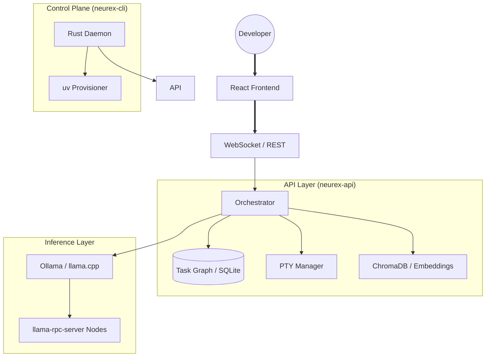

<div align="center">
  
  
  <br />

  <h1></h1>
  <h3>A local-first AI engineering workspace.</h3>

  <p align="center">
    <b>Run models locally, execute agents safely, and collaborate in real time.</b>
  </p>

  <p>
    <a href="./LICENSE"></a>
    <a href="#"></a>
    <a href="#"></a>
  </p>

  <p align="center">
    <a href="./INSTALL.md"><b>Installation</b></a> •
    <a href="./wiki/Home.md"><b>Documentation</b></a> •
    <a href="./CHANGELOG.md"><b>Changelog</b></a> •
    <a href="./KNOWN_ISSUES.md"><b>Known Issues</b></a> •
    <a href="./ROADMAP.md"><b>Roadmap</b></a>
  </p>
</div>

---

## What Is Neurex?

Neurex is a local-first AI coding IDE. It runs LLM inference on your hardware, lets agents edit files and run commands under human approval, and syncs workspaces across your LAN.

---

## System Terminology

- **Neural Mesh**
  - *Algorithm*: WebSocket broadcast of directory-change events between LAN peers discovered via mDNS, secured with mTLS.
  - *Currently does*: Syncs file creation/deletion/modification events between 2+ machines on the same network.
  - *Does not do*: Load-balance inference, share GPU memory, route cognitive workloads, or form any kind of neural network.
- **Swarm Consensus**
  - *Algorithm*: SQLite-backed multi-agent debate loop. Agents are prompted sequentially in round-robin order and output JSON `{vote: approve|reject, reason: "..."}` until 2/3 majority is reached or max rounds hit.
  - *Currently does*: Gate file mutations behind multi-agent approval when `consensus_enabled=True` (default: `False`).
  - *Does not do*: Reputation tracking, weighted voting, Byzantine fault tolerance, or any real distributed consensus protocol.
- **Semantic Memory / RAG**
  - *Algorithm*: ChromaDB vector store with `sentence-transformers` embeddings. Files are chunked by sliding window, embedded, and stored locally. Retrieval uses cosine similarity top-k.
  - *Currently does*: Persist architectural patterns across sessions for agent context grounding.
  - *Does not do*: Cross-session learning, adaptive chunking, or any form of "memory" beyond vector similarity search.
- **NeuralHarness**
  - *What it is*: An internal Python module (`core/mcp/servers/neural_harness.py`) that wraps Ollama/llama.cpp API calls with retry logic, model routing config, and token budget enforcement.
  - *It is not*: A standalone project, framework, or anything comparable to vLLM. It has 0% test coverage.
- **SkepticalMemory**
  - *What it is*: An internal Python module (`core/context/skeptical_memory.py`) that cross-references agent-recalled facts against the actual file system before trusting them.
  - *It is not*: A published library. It has 0% test coverage.

---

## Core Features

The following features are currently implemented and functional (Tier 1). For experimental and planned features, see [ROADMAP.md](./ROADMAP.md).

*   **Monaco Editor**: Full VS Code-grade editing with syntax highlighting and formatting.
*   **Agent Tool Calling**: Interactive approval prompts before agents modify files or run commands.
*   **Task Graphs**: Persistent SQLite-backed task plans for multi-stage planning and execution.
*   **Role-Based Routing**: Assign different models to planning, coding, and review tasks independently.
*   **RAG Memory**: ChromaDB-backed semantic memory for cross-session context.
*   **LSP Integration**: Connects to system-installed language servers for diagnostics and completion.
*   **Rust Control Plane**: Downloads and configures a hermetic Python environment via `uv` on first run.
*   **Dual-Remote Sync**: Sanitized git syncing between local development and GitHub.
*   **Persistent Terminals**: PTY sessions that reconnect after browser refresh.

---

## ⚠️ System Boundaries & Capabilities Disclosure

Neurex is in active development. To bridge the gap between core systems and experimental designs, please review the following boundaries:
*   **Testing / Simulation Baseline**: The automated test suite (`pytest`) runs with `NEUREX_MOCK_LLM=true` to mock inference loops for isolation. Actual agentic capability and code output synthesis require a local model endpoint (e.g. Ollama / llama.cpp).
*   **Mocked Services**: The Plugin Hub and Local Marketplace use temporary in-memory mock persistence. They do not validate published plugins or connect to a global hub.
*   **Quarantined Modules**: Speculative future features are disabled, quarantine-moved to `_quarantine/` folders, and excluded from active execution paths.

For the exact implementation status of all subsystems, see the [KNOWN_ISSUES.md](./KNOWN_ISSUES.md) document.

---

## Demo

No demo video exists yet. Core features work in isolation, but no complete user flow has been holistically verified end-to-end. 

See [DEMO.md](./DEMO.md) for recording instructions and readiness requirements.

---

## 🏛️ Architecture



---

## 🛠️ Tech Stack

### Open Source Infrastructure

| Layer | Technology |
| :--- | :--- |
| **Frontend** | React 19, Vite, Zustand, Monaco Editor, Framer Motion |
| **Backend** | FastAPI, Python 3.11+, Asyncio, Pydantic v2 |
| **Control Plane** | Rust (Tokio, Axum), `uv` for Python env management |
| **Persistence** | SQLite (task graphs), ChromaDB (vector memory) |
| **Inference** | Ollama, llama.cpp, llama-rpc-server |

### Internal Neurex Modules

These are internal python modules, not standalone published projects. They have zero test coverage.

| Module | Location | Description | Test Coverage |
| :--- | :--- | :--- | :--- |
| NeuralHarness | `core/mcp/servers/neural_harness.py` | Ollama/llama.cpp API wrapper with retry and routing | 0% |
| SkepticalMemory | `core/context/skeptical_memory.py` | Fact cross-referencing against filesystem | 0% |
| GovernanceManager | `core/security/governance.py` | Path authorization and dynamic access grants | 0% |
| FederatedRAG | `core/context/federated_rag.py` | Distributed context retrieval | 0% |

---

## 🏁 Getting Started

> [!WARNING]
> The GitHub Releases page may serve legacy binaries (e.g. `v0.5.3`) marked as "Latest" due to release tag immutability constraints. To run the current codebase (`v0.17.0`), we recommend performing the **Manual Development Install** (Option 2) or building the CLI binary directly from the `main` branch.

### 1. One-Click Bootstrap (Recommended)
Download the latest `neurex-cli` binary for your platform and run:
```bash
./neurex start
```
The CLI will provision a Python environment and install all dependencies automatically.

### 2. Manual Development Install
```bash
git clone https://github.com/RaveAgainstTheMachine/neurex.git
cd neurex

# Install all dependencies and configure git hooks
make setup

# Run the API and Web services locally
make dev
```

See [wiki/Installation.md](./wiki/Installation.md) for full setup instructions.

---

## ⚖️ Licensing

Neurex is licensed under the Apache License 2.0. See [LICENSE](./LICENSE).

---

<div align="center">
  <sub>Built by the Neurex Collective. v0.17.0.</sub>
</div>
