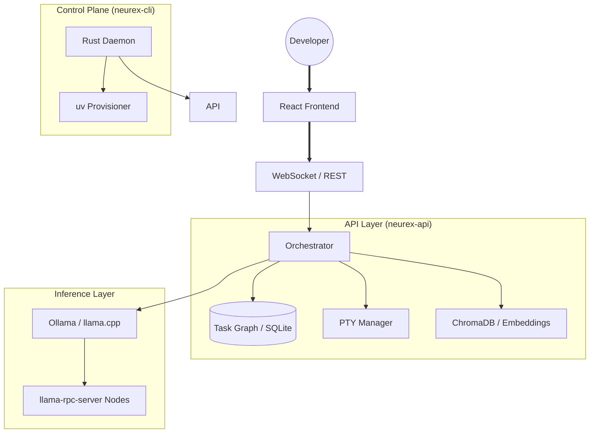

<div align="center">
  
  
  <br />

  <h1></h1>
  <h3>A local-first AI engineering workspace.</h3>

  <p align="center">
    <b>Run models locally, execute agents safely, and collaborate in real time.</b>
  </p>

  <p>
    <a href="./LICENSE"></a>
    <a href="#"></a>
    <a href="#"></a>
  </p>

  <p align="center">
    <a href="./INSTALL.md"><b>Installation</b></a> •
    <a href="./wiki/Home.md"><b>Documentation</b></a> •
    <a href="./CHANGELOG.md"><b>Changelog</b></a> •
    <a href="./CREDITS.md"><b>Credits</b></a> •
    <a href="./ROADMAP.md"><b>Roadmap</b></a>
  </p>
</div>

---

## What Is Neurex?

**Neurex** is a local-first AI engineering workspace designed for **Human-Agent Parity**. 

Rather than treating AI as a black box executing background code edits, Neurex models agents as first-class IDE collaborators. They possess active multi-cursor overlays, secure file-locking mechanisms, and real-time human-in-the-loop capability guardrails. Neurex specializes in high-fidelity cooperative tasks—such as security hardening, dependency migrations, and codebase grounding—combining a Monaco-based editor, persistent PTY terminals, and a distributed local inference layer that pools consumer GPUs across a LAN.

---

## Core Features

### 🧠 Agentic Orchestration
*   **Task Graphs**: Persistent SQLite-backed task plans for multi-stage planning and execution.
*   **Role-Based Routing**: Assign different models to planning, coding, and review tasks independently.
*   **Multi-Agent Review**: Route changes through multiple agent personas before applying them.
*   **Tool Calling & Interactive Guardrails**: Safe execution of files, shell commands, and search. Enforces real-time human capability authorization prompts under limited autonomy (v0.9.0), with safe-write bypasses (auto-approvals) for frictionless file creations.

### ⚡ Rust Control Plane (`neurex-cli`)
*   **Self-Provisioning**: Downloads and configures a hermetic Python environment via `uv` on first run — no pre-installed Python required.
*   **Process Management**: Keeps the API server and terminals alive independently of the browser session.
*   **Docker & WASM Sandboxing**: Runs agent-generated code in isolated containers.

### 🌐 Experimental Labs (Lower Priority)
*   **VRAM Pooling**: Distribute a model's layers across multiple machines via `llama-rpc-server` (functional but considered a niche power-user feature).
*   **Dynamic Re-quantization**: Automatically downgrades model precision (e.g., Q8 → Q4) under memory pressure to prevent stalls.
*   **Node Discovery & P2P Sync**: Registers peer machines and synchronizes active workspace directories dynamically over LAN via secure mTLS (v0.9.0).

### 📁 IDE Features
*   **Monaco Editor**: Full VS Code-grade editing with syntax highlighting and formatting.
*   **LSP Integration**: Connects to system-installed language servers for diagnostics and completion.
*   **Multi-Root Workspaces**: Manage multiple project roots in a single session.
*   **Persistent Terminals**: PTY sessions that reconnect after browser refresh.
*   **RAG & Swarm Collective Memory**: Cross-session cognitive persistence (Semantic Memory) storing codebase architectural patterns, indexable via ChromaDB and local embedding models.

---

## ⚠️ System Boundaries & Capabilities Disclosure

Neurex is in active development. To bridge the gap between core systems and experimental designs, please review the following boundaries:
*   **Testing / Simulation Baseline**: The automated test suite (`pytest`) runs with `NEUREX_MOCK_LLM=true` to mock inference loops for isolation. Actual agentic capability and code output synthesis require a local model endpoint (e.g. Ollama / llama.cpp).
*   **Mocked Services**: The Plugin Hub and Local Marketplace use temporary in-memory mock persistence. They do not validate published plugins or connect to a global hub.
*   **Quarantined Modules**: Speculative future features (Phases 45-60) are disabled, quarantine-moved to `_quarantine/` folders, and excluded from active execution paths.

For the exact implementation status of all subsystems, see the [wiki/System-Capabilities.md](./wiki/System-Capabilities.md) guide.

---

## 🏛️ Architecture



---

## 🛠️ Tech Stack

| Layer | Technologies |
| :--- | :--- |
| **Frontend** | React 19, Vite, Zustand, Monaco Editor, Framer Motion |
| **Backend** | FastAPI, Python 3.11+, Asyncio, Pydantic v2 |
| **Control Plane** | Rust (Tokio, Axum), `uv` for Python env management |
| **Persistence** | SQLite (task graphs), ChromaDB (vector memory) |
| **Inference** | Ollama, llama.cpp, llama-rpc-server |

---

## 🏁 Getting Started

> [!WARNING]
> The GitHub Releases page may serve legacy binaries (e.g. `v0.5.3`) marked as "Latest" due to release tag immutability constraints. To run the current codebase (`v0.15.3`), we recommend performing the **Manual Development Install** (Option 2) or building the CLI binary directly from the `main` branch.

### 1. One-Click Bootstrap (Recommended)
Download the latest `neurex-cli` binary for your platform and run:
```bash
./neurex start
```
The CLI will provision a Python environment and install all dependencies automatically.

### 2. Manual Development Install
```bash
git clone https://github.com/RaveAgainstTheMachine/neurex.git
cd neurex/neurex-cli
cargo run -- start
```

See [INSTALL.md](./INSTALL.md) for full setup instructions.

---

## ⚖️ Licensing

Neurex is licensed under the **Business Source License 1.1** (BSL).

- **Non-Commercial Use**: Free for personal and educational use.
- **Commercial Use**: Free for entities with annual gross revenue below **$5,000,000 USD**.
- **Change Date**: On **January 1, 2030**, the license converts to the **Apache License, Version 2.0**.

See [LICENSE](./LICENSE) for full details.

---

<div align="center">
  <sub>Built by the Neurex Collective. v0.15.3.</sub>
</div>
