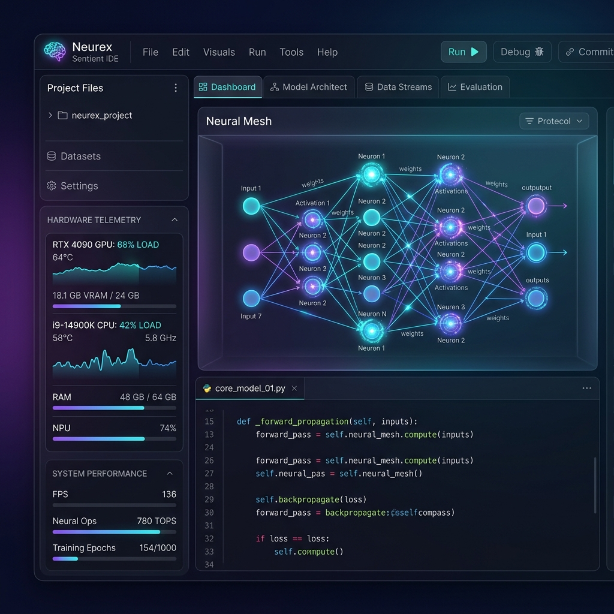
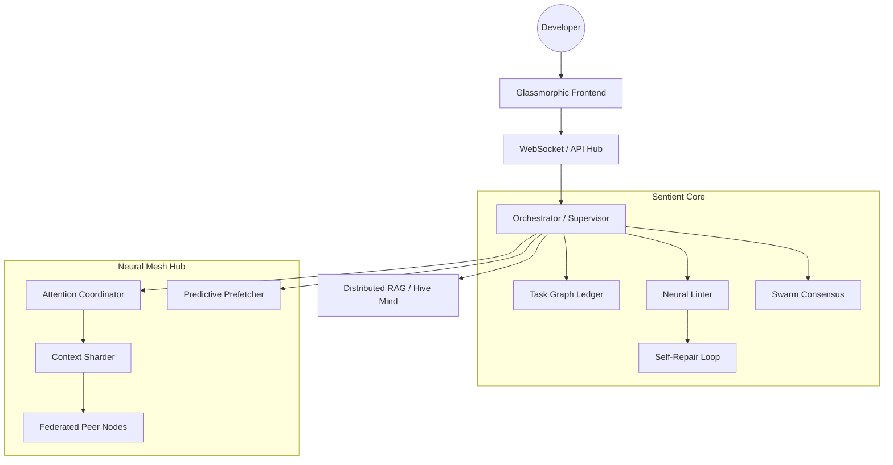

<div align="center">
  
  <h1>⬡ Neurex</h1>
  <p><b>The Sentient-Class Agentic IDE & Unified Neural Mesh Hub</b></p>
 
  [](https://opensource.org/licenses/MIT)
  [](#)
  [](#)
  [](#)
 
  <p><i>"The IDE that doesn't just execute; it evolves."</i></p>
 
  [Explore Wiki](file:///games/CodeProjects/AntiGravity/Neurex/neurex/wiki/Home.md) • [View Roadmap](./ROADMAP.md) • [Report Bug](https://github.com/antigravity/neurex/issues)
</div>
 
---
 
## 📖 Table of Contents
- [Vision](#-vision)
- [Key Features](#-key-features)
- [Architecture](#-architecture)
- [Tech Stack](#-tech-stack)
- [Getting Started](#-getting-started)
- [Core Services](#-core-services)
- [Roadmap](#-roadmap)
- [Contributing](#-contributing)
- [License](#-license)
 
---
 
## 👁️ Vision
**Neurex** is a high-performance, autonomous development substrate designed for **Human-Agent Parity**. In the Neurex ecosystem, the IDE is not a passive tool, but a sentient collaborator—capable of real-time architectural oversight, autonomous self-repair, and federated neural reasoning across a decentralized mesh.
 
---
 
## ✨ Key Features
 
### 🧠 Sentient Autonomy
- **[PHASE 50] Sentient Singularity**: Autonomous goal setting and self-generating capabilities.
- **[PHASE 51] Neural Self-Synthesis**: Autonomous project inception and recursive self-improvement.
- **[PHASE 52] Universal Consensus**: Global substrate coherence and weight-space protocol alignment.
- **[PHASE 53] Neural Temporal Synthesis**: Neural state snapshotting and quantum architectural simulation.
- **[PHASE 54] Universal Hermetic Substrate**: Zero-dependency distribution via native Rust daemon and autonomous `uv` provisioning.
- **Neural Collective Intelligence**: Secure, cross-project knowledge distillation and global best practices (Phase 49).
- **Neural Evolution**: Autonomous adapter fine-tuning and architectural mutation (Phase 48).
- **Neural Hardware Virtualization**: Mesh-wide VRAM pooling and autonomous re-quantization.
- **Neural Linter**: Real-time architectural validation of every code mutation.
- **Autonomous Self-Repair**: Intelligent agents that detect and fix their own regressions.
- **Deep Neural Integration**: Federated attention pooling and context sharding.
- **Predictive Prefetching**: Eliminates cold-start latency by warming model weights based on agent trajectory.
 
### ⚡ Kinetic Excellence
- **Zero-Restart Evolution**: Hot-swapping core logic and Python modules in-place at runtime.
- **Skeptical Memory**: Zero-trust context management that verifies filesystem reality before every mutation.
- **Glassmorphic UI**: A high-fidelity, performance-driven interface designed for deep focus.
 
---
 
## 🏛️ Architecture
 

 
---
 
## 🛠️ Tech Stack
 
- **Frontend**: `React 18`, `Vite`, `Zustand`, `Monaco Editor`, `Framer Motion`.
- **Backend**: `FastAPI`, `Python 3.11+`, `Asyncio`, `Pydantic v2`.
- **Inference**: `NeuralHarness v2.0`, `llama-cpp-python`, `structlog`.
- **Persistence**: `SQLite` (Tasks), `ChromaDB` (Vector Memory), `SkepticalMemory`.
 
---
 
## 🚀 Getting Started
 
### 1. Prerequisites
- **OS**: Linux (Ubuntu 22.04+ / Arch Linux), macOS (M1/M2/M3), or Windows 11.
- **Compute**: NVIDIA GPU (RTX 3090+), Apple Silicon (16GB+ RAM), or NPU-ready hardware.
- **Software**: None required for Control Plane. `neurex-cli` autonomously provisions its own hermetic Python runtime. (Docker required for Sandbox only).
 
### 2. Installation
```bash
# Clone the repository
git clone https://github.com/antigravity/neurex.git
cd neurex
 
# Execute the Universal Installer (Autodetects hardware acceleration)
./install.sh
```
 
### 3. Launch
```bash
# Start the Universal Substrate (Autodetects and provisions runtime)
cd neurex-cli
cargo run -- start
```
*The IDE will be accessible at `http://localhost:3000`.*
 
---
 
## 🛰️ Core Services
 
- **LiveReloader**: Enables zero-restart evolution of agent logic.
- **PredictiveMaintenance**: Autonomous background re-indexing and state synchronization.
- **NeuralExplorer**: Hybrid semantic/relational retrieval for deep codebase awareness.
 
---
 
## 🗺️ Roadmap
We are currently in **Phase 54: Universal Hermetic Substrate**.
- [x] Phase 51: Neural Self-Synthesis (Autonomous Inception)
- [x] Phase 52: Universal Neural Consensus (Omniscient State)
- [x] Phase 53: Neural Temporal Synthesis (Transcendence Logic)
- [x] Phase 54: Universal Hermetic Substrate (Zero-Dependency)
 
See [ROADMAP.md](./ROADMAP.md) for the full strategic trajectory.
 
---
 
## 🤝 Contributing
Neurex is built on **Anti-Gravity Principles**. All contributions must pass:
1. **Neural Linter** validation.
2. **Consensus Review** by the Agent Council.
3. **HyperPlan** architectural verification.
 
Refer to [CONTRIBUTING.md](./CONTRIBUTING.md) for the full protocol.
 
---
 
## 📄 License
This project is licensed under the MIT License - see the [LICENSE](./LICENSE) file for details.
 
---
<div align="center">
  <p>Developed by <b>Steven Frost</b> and the <b>Antigravity</b> Agentic Core.</p>
  <p><i>Mesh synchronized by Neurex Somnus.</i></p>
</div>
