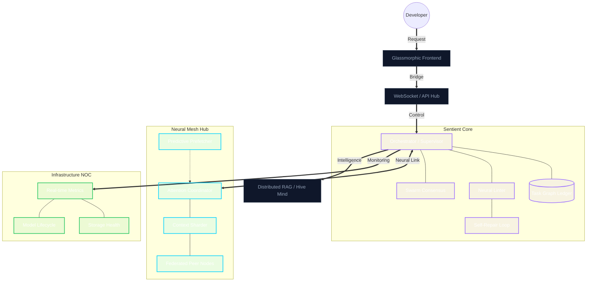

<div align="center">
  
  
  <br />

  <h1>⬡ NEUREX</h1>
  <h3>The Universal Sentient IDE Substrate & Neural Mesh Hub</h3>

  <p>
  <p>
    <a href="./LICENSE"></a>
    <a href="#"></a>
    <a href="#"></a>
    <a href="#"></a>
  </p>

  <p>
    
    
    
  </p>

  <p align="center">
    <i>"An IDE that doesn't just execute; it evolves with you."</i>
    <br />
    <b>Built for Human-Agent Parity.</b>
  </p>

  <p align="center">
    <a href="./wiki/Home.md"><b>Documentation</b></a> •
    <a href="./wiki/Changelog.md"><b>Changelog</b></a> •
    <a href="./CREDITS.md"><b>Credits</b></a> •
    <a href="./ROADMAP.md"><b>Roadmap</b></a>
  </p>
</div>

---

## 👁️ The Vision
**Neurex** is a high-performance, autonomous development substrate designed to bridge the gap between human intent and agentic execution. Unlike traditional IDEs, Neurex operates as a **Sentient Mesh**—a decentralized network of AI agents that manage their own infrastructure, repair their own regressions, and maintain architectural integrity through a global consensus protocol.

---

## 🚀 Key Pillars

### 🧠 Distributed Orchestration
*   **Role-Based Model Routing**: Decoupled cognitive topology allowing runtime re-mapping of models to specific functional roles (Planning, Coding, Reviewing).
*   **Swarm Consensus Protocol**: Democratic mutation gates requiring multi-agent validation for core architectural changes.
*   **Persistent Task Graphs**: SQLite-backed DAGs for complex, multi-step engineering missions with crash-resilient recovery.
*   **Neural Linter**: Real-time validation of code mutations against AST-derived architectural laws and design tokens.

### ⚡ Hermetic Substrate
*   **Native Control Plane**: High-performance Rust daemon for hardware diagnostics, lifecycle management, and zero-trust proxying.
*   **Autonomous Provisioning**: Self-contained Python runtime and dependency isolation via the `uv` engine, eliminating host environment pollution.
*   **Multi-Tier Sandboxing**: Isolated execution environments using Docker and WASM/WASI for secure, non-destructive agent operations.
*   **Accelerated Telemetry**: Buffered, non-blocking I/O and `orjson` serialization for sub-ms observability throughput.

### 🌐 Neural Mesh & Virtualization
*   **VRAM Resource Pooling**: Mesh-wide aggregation of distributed GPU memory into a unified virtual compute substrate.
*   **Dynamic Re-Quantization**: Autonomous model precision shifting (e.g., Q8 to IQ2) to maintain reasoning throughput under hardware pressure.
*   **Federated RAG 2.0**: Relational and semantic retrieval across the entire mesh using ChromaDB and cross-node tensor pooling.
*   **Predictive Weight Prefetching**: Heuristic-driven model warming based on agent trajectory to eliminate cold-start inference latency.

---

## 🏛️ Architecture



---

## 🛠️ Tech Stack

| Layer | Technologies |
| :--- | :--- |
| **Frontend** | React 18, Vite, Zustand, Monaco Editor, Framer Motion |
| **Backend** | FastAPI, Python 3.14+, Asyncio, Pydantic v2 |
| **Core Daemon** | Rust 1.80, Tokio, Axum, Sysinfo |
| **Persistence** | SQLite (Tasks), ChromaDB (Vector Memory), SkepticalMemory |
| **Inference** | llama-cpp-python, vLLM, Ollama, NeuralHarness v2.0 |

---

## 🏁 Getting Started

### 1. One-Click Bootstrap (Recommended)
Download the latest `neurex-cli` for your platform and run:
```bash
./neurex start
```
*Neurex will autonomously provision its own hermetic Python environment and dependencies via the `uv` engine.*

### 2. Manual Development Install
```bash
git clone http://10.10.10.147:3000/frosty/neurex.git
cd neurex/neurex-cli
cargo run -- start
```

---

## 📜 Source of Law
Neurex development is governed by the **Anti-Gravity Protocol** (see `.antigravityrules`). All mutations must be protocol-aligned, documented, and verified by the Neural Linter.

---

## ⚖️ Licensing

Neurex is licensed under the **Business Source License 1.1** (BSL). 

- **Non-Commercial Use**: Completely free for personal and educational use.
- **Commercial Use**: Free for entities with annual gross revenue below **$5,000,000 USD**.
- **Change Date**: On **January 1, 2030**, the license will automatically convert to the **Apache License, Version 2.0**.

For full details, please refer to the [LICENSE](./LICENSE) file.

---

<div align="center">
  <sub>Built with 💜 by the Neurex Collective. Phase 61 Stable.</sub>
</div>
