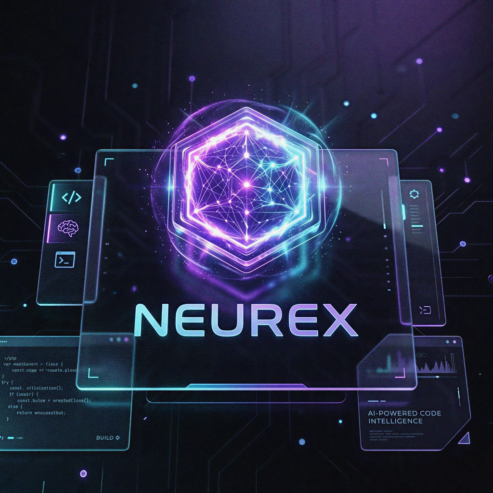
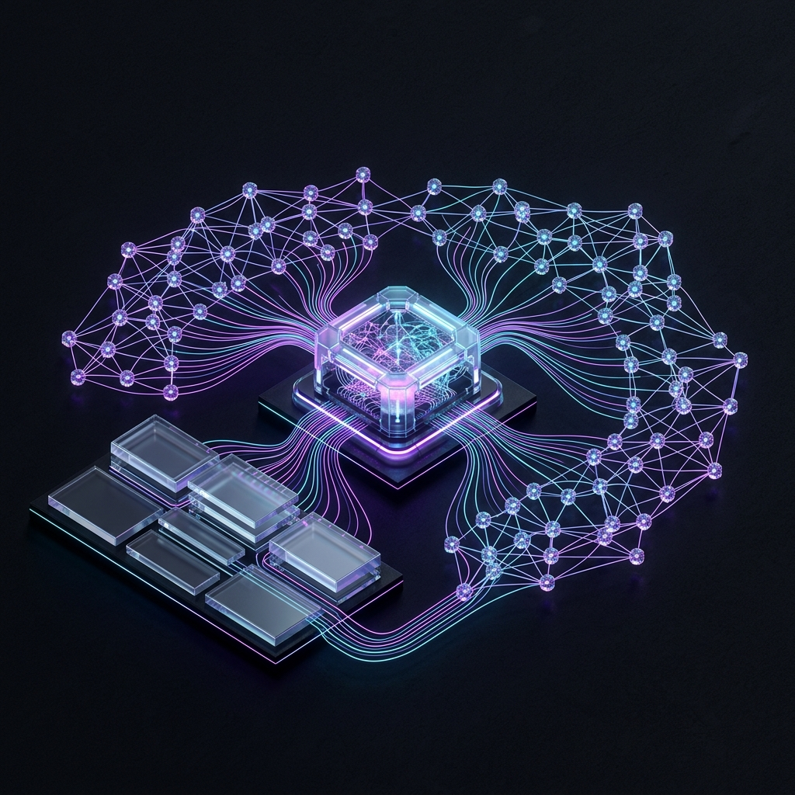
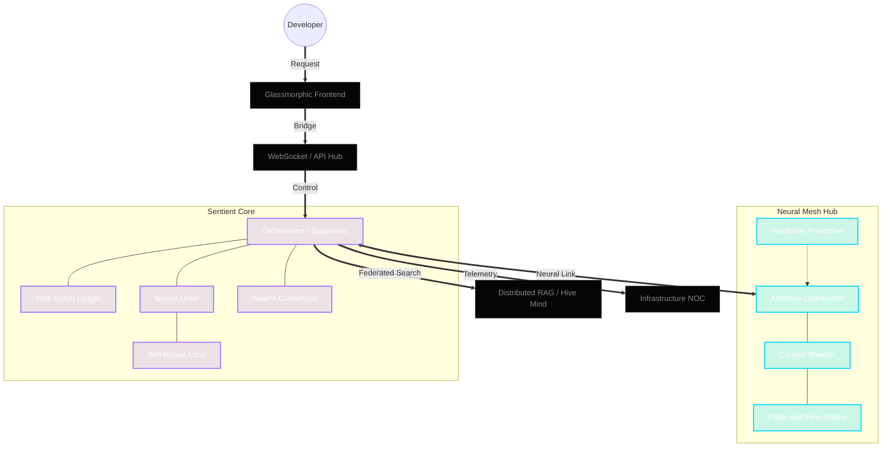

<div align="center">
  
  
  <br />

  <h1>⬡ NEUREX</h1>
  <h3>The Universal Sentient IDE Substrate & Neural Mesh Hub</h3>

  <p>
    <a href="https://opensource.org/licenses/MIT"></a>
    <a href="#"></a>
    <a href="#"></a>
    <a href="#"></a>
  </p>

  <p align="center">
    <i>"An IDE that doesn't just execute; it evolves with you."</i>
    <br />
    <b>Built for Human-Agent Parity.</b>
  </p>

  <p align="center">
    <a href="./wiki/Home.md"><b>Documentation</b></a> •
    <a href="./wiki/Changelog.md"><b>Changelog</b></a> •
    <a href="http://10.10.10.147:3000/frosty/neurex/issues"><b>Report Bug</b></a> •
    <a href="./ROADMAP.md"><b>Roadmap</b></a>
  </p>
</div>

---

## 👁️ The Vision
**Neurex** is a high-performance, autonomous development substrate designed to bridge the gap between human intent and agentic execution. Unlike traditional IDEs, Neurex operates as a **Sentient Mesh**—a decentralized network of AI agents that manage their own infrastructure, repair their own regressions, and maintain architectural integrity through a global consensus protocol.

---

## 🚀 Key Pillars

### 🧠 Sentient Autonomy
*   **Infrastructure NOC**: Real-time telemetry for storage health, multi-disk environments, and "Hot/Cold" model states.
*   **Neural Self-Repair**: Autonomous agents that detect, analyze, and fix their own regressions in real-time.
*   **Neural Linter**: Architectural validation of every code mutation against project-specific design laws.
*   **Swarm Consensus**: Democratic governance for critical assets, requiring multi-agent approval for core mutations.

### ⚡ Kinetic Performance
*   **Hermetic Substrate**: Zero-dependency distribution via a native Rust daemon and autonomous `uv` provisioning.
*   **Glassmorphic UI**: A high-fidelity, GPU-accelerated interface designed for deep architectural focus.
*   **Predictive Prefetching**: Eliminates cold-start latency by warming model weights based on agent trajectory.

### 🌐 Universal Connectivity
*   **Federated RAG 2.0**: Semantic and relational retrieval across the entire Mesh.
*   **Neural Virtualization**: Mesh-wide VRAM pooling and autonomous re-quantization to fit distributed hardware.
*   **Native Gitea Sync**: Professional issue tracking and substrate synchronization directly with the origin server.

---

## 🏛️ Architecture

<div align="center">
  <a href="./assets/neurex_arch.png" target="_blank">
    
  </a>
  <p><i>Click the diagram above to explore the high-fidelity isometric substrate.</i></p>
</div>

<details>
<summary><b>View Stylized Logic Flowchart</b></summary>



</details>

---

## 🛠️ Tech Stack

| Layer | Technologies |
| :--- | :--- |
| **Frontend** | React 18, Vite, Zustand, Monaco Editor, Framer Motion |
| **Backend** | FastAPI, Python 3.14+, Asyncio, Pydantic v2 |
| **Core Daemon** | Rust 1.80, Tokio, Axum, Sysinfo |
| **Persistence** | SQLite (Tasks), ChromaDB (Vector Memory), SkepticalMemory |
| **Inference** | llama-cpp-python, vLLM, Ollama, NeuralHarness v2.0 |

---

## 🏁 Getting Started

### 1. One-Click Bootstrap (Recommended)
Download the latest `neurex-cli` for your platform and run:
```bash
./neurex start
```
*Neurex will autonomously provision its own hermetic Python environment and dependencies via the `uv` engine.*

### 2. Manual Development Install
```bash
git clone http://10.10.10.147:3000/frosty/neurex.git
cd neurex/neurex-cli
cargo run -- start
```

---

## 📜 Source of Law
Neurex development is governed by the **Anti-Gravity Protocol** (see `.antigravityrules`). All mutations must be protocol-aligned, documented, and verified by the Neural Linter.

---

<div align="center">
  <sub>Built with 💜 by the Neurex Collective. Phase 55 Stable.</sub>
</div>
