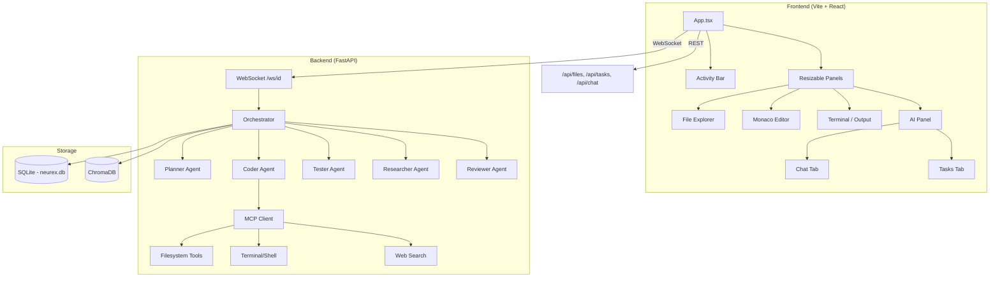

# Neurex IDE — Development Plan

> Updated: 2026-04-24 | Target: Windsurf-style agentic IDE powered by local LLMs

---

## Current State

### What exists and works

| Layer | Component | Status | Notes |
|---|---|---|---|
| **Frontend** | Vite + React + TypeScript scaffold | ✅ Building | Clean build, HMR running on :3000 |
| **Frontend** | Monaco Editor (`@monaco-editor/react`) | ✅ Integrated | Custom `neurex-dark` theme, tab system, breadcrumbs |
| **Frontend** | File Explorer | ✅ Working | Fixed root path expansion; full navigation active |
| **Frontend** | AI Chat Panel | ✅ Rendered | Chat + Tasks tabs, assembled assistant replies |
| **Frontend** | Resizable Panels | ✅ Working | `react-resizable-panels` v2, drag handles |
| **Frontend** | Infra Panel | ✅ Working | Real metrics, skill management, quantization deploy |
| **Frontend** | Activity Bar | ✅ Working | Explorer, Search, Git, Agents, Infrastructure Hub |
| **Frontend** | Status Bar | ✅ Working | WS status indicator, system resource usage |
| **Frontend** | Zustand Store | ✅ Working | Refactored WS communication, multi-terminal state |
| **Backend** | FastAPI + uvicorn | ✅ Running | Port 8000, health endpoint, CORS |
| **Backend** | WebSocket handler | ✅ Working | Improved persistence, assembled message blocks |
| **Backend** | Orchestrator | ✅ Working | 3-phase: plan → approve → execute |
| **Backend** | Agent team | ✅ Working | Planner, Coder, Tester, Researcher, Reviewer, Summarizer |
| **Backend** | MCP Tool registry | ✅ Working | Skills manager with toggleable tool collections |
| **Backend** | Task Graph (SQLite) | ✅ Working | CRUD, status machine, stall detection |
| **Backend** | Chat persistence | ✅ Working | Reliable SQLite persistence for both WS and REST |
| **Backend** | HITL shell approval | ✅ Working | Safe command allowlist, approval gateway |
| **Backend** | Terminal sandbox | ⚠️ Partial | Docker sandbox defined but falls back to host exec (no Docker image built) |
| **Backend** | Memory worker (ChromaDB) | ⚠️ Degraded | Graceful fallback implemented for missing ChromaDB |
| **Backend** | Tree-sitter chunker | ⚠️ Degraded | Sliding window fallback for missing TS dependencies |

### Known bugs

| Bug | Severity | Root Cause |
|---|---|---|
| ChromaDB connection failures flood logs | Low | Fixed: Added graceful degradation and connect-on-demand |
| `tree_sitter_languages` import error | Low | Fixed: Chunker falls back to sliding window safely |
| Chat messages not persisted via WS | High | Fixed: Reliable internal helper with isolated sessions |
| File explorer doesn't show `path` on dirs | Low | Fixed: Corrected root path detection and API walk logic |

---

## Development Roadmap

### Phase 1 — Stabilize Core (Priority: NOW)

> [!IMPORTANT]
> These items block the IDE from being genuinely usable. Fix before adding features.

#### 1.1 Fix chat persistence through WebSocket

The WebSocket handler streams orchestrator events but never persists messages. User messages and assistant replies vanish on refresh.

**Files:** [websocket.py](file:///games/CodeProjects/AntiGravity/Neurex/neurex/neurex-api/api/websocket.py)

- [x] After receiving `type: "message"`, POST the user message to `/api/chat/message`
- [x] After `orch.run()` completes, assemble assistant response and persist
- [x] Frontend `useWebSocket` already calls `GET /api/chat/{id}` on mount — this is now stable

#### 1.2 Fix or disable ChromaDB memory worker

The worker crashes because ChromaDB isn't running. This floods logs with errors and slows startup.

**Files:** [worker.py](file:///games/CodeProjects/AntiGravity/Neurex/neurex/neurex-api/core/memory/worker.py), [main.py](file:///games/CodeProjects/AntiGravity/Neurex/neurex/neurex-api/main.py)

- [x] Option B: Make worker gracefully degrade — wrap connect in try/except, disable indexing if unavailable
- [x] Chunker fallback implemented (sliding window)

#### 1.3 Conversation management

Currently hardcoded to `conversation_id = "default"`. Need multi-conversation support.

**Files:** [App.tsx](file:///games/CodeProjects/AntiGravity/Neurex/neurex/neurex-web/src/App.tsx), [store.ts](file:///games/CodeProjects/AntiGravity/Neurex/neurex/neurex-web/src/lib/store.ts)

- [ ] Add conversation list sidebar (below Activity Bar or in a dropdown)
- [ ] "New Chat" button that generates a UUID and switches context
- [ ] Persist `activeConversationId` to localStorage

---

### Phase 2 — Terminal Integration

> [!TIP]
> This is the single biggest missing piece vs Windsurf. The bottom panel is currently just a text log.

#### 2.1 Real terminal with xterm.js
- [x] Use `@xterm/xterm` + standard FitAddon (jitter-free)
- [x] Backend PTY handler implemented
- [x] Bottom panel tab row: OUTPUT | TERMINAL | PROBLEMS

#### 2.2 Agent output → terminal
- [x] Emit `terminal_output` events from the orchestrator
- [x] Frontend routes these to the xterm instance

---

### Phase 3 — Editor Power Features

#### 3.1 Inline diff view
- [ ] Use Monaco's `createDiffEditor` API
- [ ] Show "Accept" / "Reject" buttons on each diff hunk
- [ ] Only apply the write after user confirms (or auto-accept in fast mode)

#### 3.2 File save (write-back)
- [x] Add Ctrl+S handler that POSTs to `/api/files/save`
- [x] Backend: add `save` route with path-traversal protection
- [x] Show saved/unsaved indicator in tab

#### 3.3 Search panel

Wire up the "Search" activity bar tab.

- [ ] Backend: Add `/api/files/search?query=...&regex=false` endpoint using `grep -rn`
- [ ] Frontend: Search input + results list that opens files at the matching line
- [ ] Use Monaco's `revealLineInCenter()` to jump to results

#### 3.4 Syntax highlighting for more languages

- [ ] Register additional Monaco language tokenizers if needed
- [ ] Extend the `LANG_MAP` in `FileExplorer.tsx` and `store.ts`

---

### Phase 4 — Agent Intelligence

#### 4.1 Streaming markdown in chat

Currently the AI panel renders `msg.content` as plain text. Windsurf renders markdown with code blocks, headers, and inline code.

- [ ] Install `react-markdown` + `rehype-highlight`
- [ ] Render assistant messages through the markdown pipeline
- [ ] Style code blocks to match the `neurex-dark` theme

#### 4.2 Context-aware agent

The RAG pipeline (ChromaDB) is broken. Once fixed:

- [ ] Agents should automatically include relevant code context in their prompts
- [ ] Show "Context: 5 files indexed" in the status bar
- [ ] Add a "Reindex" button

#### 4.3 Planner refinement

The planner currently generates multi-step plans for trivial requests despite the "Direct Action Rule."

- [ ] Tighten the system prompt to classify requests as "direct" vs "planned"
- [ ] For direct requests, skip AWAITING_APPROVAL and execute immediately
- [ ] Add a confidence threshold — if the planner is unsure, ask the user

#### 4.4 File-aware tool calls

When the user has a file open in the editor, the agent should know about it.

- [ ] Send `activeFile` and its content as part of the WS message context
- [ ] Agents can reference "the currently open file" in their responses

---

### Phase 5 — Polish & Production

#### 5.1 UI refinements

- [ ] Git status integration (activity bar tab → `git status`, branch display in status bar)
- [ ] Keyboard shortcuts (Ctrl+P file picker, Ctrl+Shift+P command palette)
- [ ] Command palette using a modal with fuzzy search
- [ ] Settings panel (model selection, theme, font size)
- [ ] Notification toasts for agent events

#### 5.2 Multi-model support

- [ ] Model selector dropdown in the AI panel header
- [ ] Support OpenAI-compatible APIs (not just Ollama)
- [ ] Per-agent model assignment (e.g., small model for planner, large for coder)

#### 5.3 Docker sandbox

- [ ] Build the `neurex-sandbox` Docker image with common dev tools
- [ ] Add `Dockerfile.sandbox` to the repo
- [ ] Remove the host-exec fallback in production mode

#### 5.4 Extension system

- [ ] Define a plugin API for adding new tools, agents, and UI panels
- [ ] Hot-reload plugins from a `~/.neurex/plugins/` directory

---

### Phase 6 — LLM Infrastructure & Control Module

> [!TIP]
> Neurex should act as a command center for open-source AI, managing the engines and models it relies on, and intelligently routing tasks to the best available resource.

#### 6.1 Engine Management

Ability to install, update, and fully control open-source inference backends.

- [x] Abstraction layer supporting `vLLM`, `llama.cpp`, `Ollama`, and `Aphrodite`.
- [x] UI Panel: "AI Infrastructure" tab to manage installed engines (Start, Stop, Update, Configure VRAM).
- [x] Backend: System metrics (VRAM/RAM) wired to UI.

#### 6.2 Model Lifecycle & Benchmarking

Manage local weights (GGUF, Safetensors) and quantify their performance.

- [ ] Search, download, and delete models directly from HuggingFace and local registries.
- [ ] **Automated Benchmarking**: Run standardized coding evaluations against active models.
- [ ] Track metrics: Tokens-per-second (TPS), time-to-first-token (TTFT), VRAM usage, and pass@1 accuracy.
- [ ] UI view to compare side-by-side performance metrics of different models/engines.

#### 6.3 Task-Aware Routing (Auto-Selection)

Neurex should autonomously determine and recommend the best model/engine for a specific IDE task.

- [ ] Routing heuristic based on task complexity (e.g., fast `7B` models for autocomplete, heavy `32B+` models for architecture planning).
- [ ] Capability classes allowing agents to request specific hardware/model profiles.
- [ ] Dynamic fallback mechanisms if the preferred engine is busy or out of memory.

---

### Phase 7 — Mobile Agent & Secure Perimeter (PWA)

> [!TIP]
> Transform Neurex from a desktop IDE into an ultra-secure, voice-enabled personal assistant that lives in your pocket.

#### 7.1 Progressive Web App (PWA) & Mobile UX
- [ ] Add `manifest.json` and service workers to support "Add to Homescreen" on iOS/Android.
- [ ] Design a sleek, uncluttered mobile viewport layout (collapsible sidebars, thumb-friendly targets).
- [ ] Implement a mobile task queue view: view, approve, comment on, and delete pending tasks.

#### 7.2 Voice IO & Notifications
- [ ] **Voice-to-Text**: Integrate Web Speech API (or Whisper backend) for dictating commands.
- [ ] **Text-to-Voice**: Add TTS support so the agent can read responses aloud.
- [ ] **Push Notifications**: Implement Web Push API / VAPID or a lightweight polling mechanism to notify mobile users of tasks requiring approval.

#### 7.3 Secure Perimeter & File Operations
- [ ] **Reverse Proxy**: Add Nginx/Traefik configuration with automated Let's Encrypt SSL generation for secure internal/external domain access.
- [ ] **Auth Layer**: Ensure WebSocket and REST endpoints are heavily authenticated for public exposure.
- [ ] **File IO**: Support secure file uploads (camera/photo library) and downloads directly from the mobile UI to the workspace.

#### 7.4 Pre-Baked Skills Integration
- [ ] Build a plugin loader for community skills (e.g., `antigravity-awesome-skills`, `caveman`).
- [ ] Expose a UI marketplace/list to toggle specific skills on or off for the active agent.

### Phase 8 — Enterprise Collaboration & Zero-Trust Security

> [!TIP]
> Evolve Neurex from a single-player local tool into a secure, multi-user remote collaboration hub with strict access controls and audit trails.

#### 8.1 Zero-Trust Remote Access (mTLS & API Keys)
- [ ] **mTLS configuration**: Update Caddy to require client-side SSL certificates for ultra-secure remote desktop access.
- [ ] **Auth Middleware**: Implement JWT/API-Key based authentication for all REST and WebSocket endpoints in FastAPI.

#### 8.2 Identity & Role-Based Access Control (RBAC)
- [ ] **User Management**: Build user creation, team groupings, and permission roles (Admin, Developer, Viewer).
- [ ] **Granular Scopes**: Control which users can approve tasks, execute shell commands, or access specific workspaces.

#### 8.3 Collision Prevention & Collaboration
- [ ] **File Locking**: Implement a distributed lock manager (Redis or SQLite-based) to prevent two users (or agents) from editing the same file simultaneously.
- [ ] **Real-time Sync**: Add WebSocket broadcasting to instantly reflect task state changes, file edits, and chat messages to all connected clients.

#### 8.4 Audit & System Logging
- [ ] **System Logs UI**: Add a dedicated "System Logs" tab to the Desktop Activity Bar.
- [ ] **Audit Trail**: Record and display all remote access attempts, hit-in-the-loop approvals, and agent actions with timestamps and user IDs.

---

## Architecture Reference



## File Map

```
neurex/
├── neurex-api/                 # Python backend
│   ├── main.py                 # FastAPI entry, lifespan, CORS
│   ├── .env                    # WORKSPACE_PATH, API_TOKEN, MODEL
│   ├── api/
│   │   ├── websocket.py        # WS handler, auth, event streaming
│   │   └── routes/
│   │       ├── chat.py         # Chat history CRUD
│   │       ├── files.py        # File tree + read
│   │       └── tasks.py        # Task CRUD + clear
│   └── core/
│       ├── orchestrator.py     # 3-phase: plan → approve → execute
│       ├── task_graph.py       # SQLModel TaskNode, SQLite engine
│       ├── agents/
│       │   ├── base_agent.py   # Ollama streaming, tool dispatch, RAG
│       │   ├── planner_agent.py
│       │   ├── coder_agent.py  # read_file, write_file, run_command
│       │   ├── tester_agent.py
│       │   ├── researcher_agent.py
│       │   ├── reviewer_agent.py
│       │   └── summarizer_agent.py
│       ├── mcp/
│       │   ├── client.py       # Tool registry + dispatcher
│       │   └── tools/
│       │       ├── filesystem.py
│       │       ├── terminal.py # Docker sandbox + HITL approval
│       │       └── researcher.py
│       ├── memory/
│       │   ├── worker.py       # File watcher + ChromaDB indexer
│       │   ├── chunker.py      # Tree-sitter code splitter
│       │   └── embedder.py
│       └── context/
│           ├── manager.py      # ChromaDB retrieval
│           └── rules_parser.py # .neurexrules loader
│
├── neurex-web/                 # React frontend (Vite)
│   ├── index.html
│   ├── src/
│   │   ├── main.tsx
│   │   ├── App.tsx             # Layout: activity bar + panels + status bar
│   │   ├── App.css
│   │   ├── index.css           # Design system tokens
│   │   ├── lib/
│   │   │   ├── types.ts        # TypeScript interfaces
│   │   │   └── store.ts        # Zustand + Immer state
│   │   ├── hooks/
│   │   │   └── useWebSocket.ts # WS connection + event routing
│   │   └── components/
│   │       ├── FileExplorer/
│   │       ├── Editor/
│   │       └── AIPanel/
│
├── .neurexrules                # Project-level agent rules
├── docker-compose.yml
└── Makefile
```
